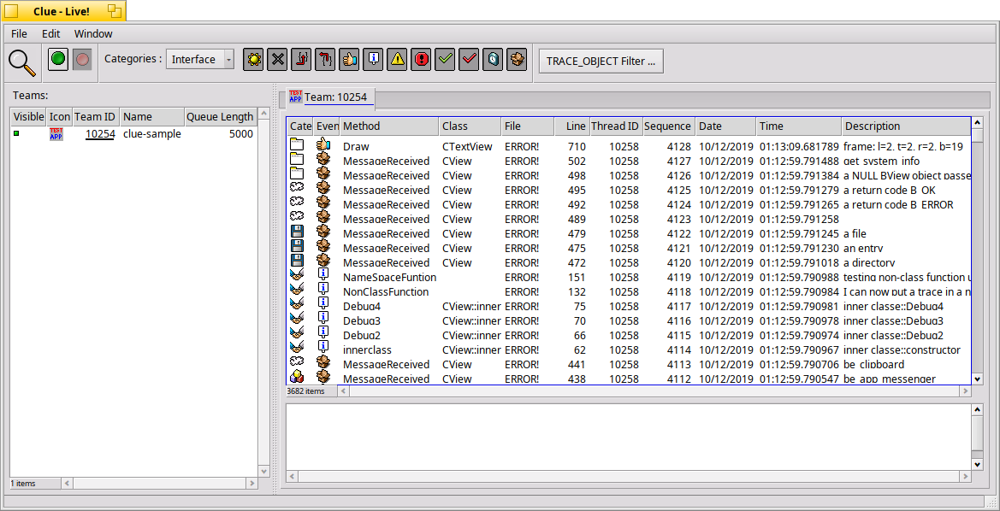

# Clue

The most comprehensive BeOS GUI tracing tool, allowing inspection on almost all of the BeOS native objects.



## Build Instructions

```shell
~$ cd Clue
~/Clue$ cmake .
~/Clue$ make
```
*Note: You may want to use multiple jobs to speed things up, like `make -j8`*
